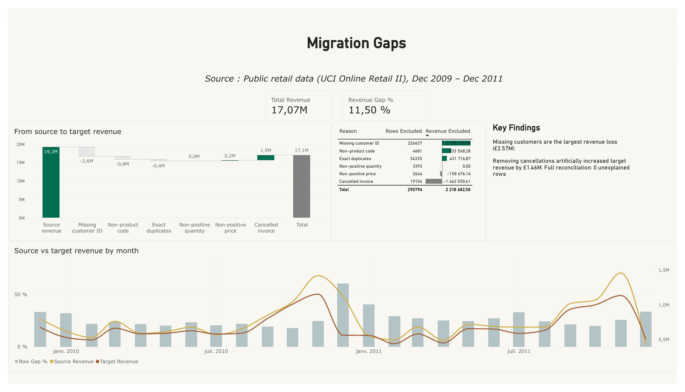
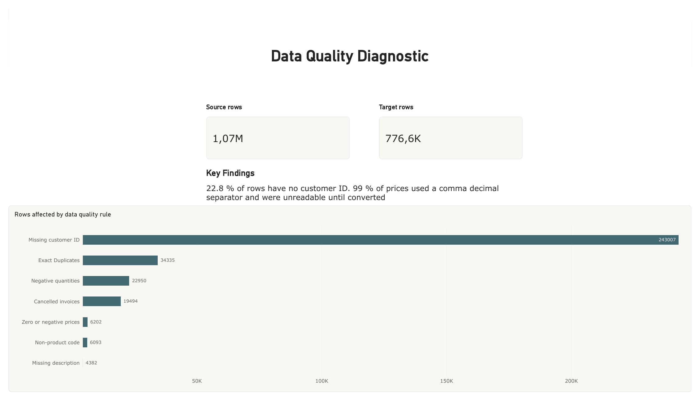
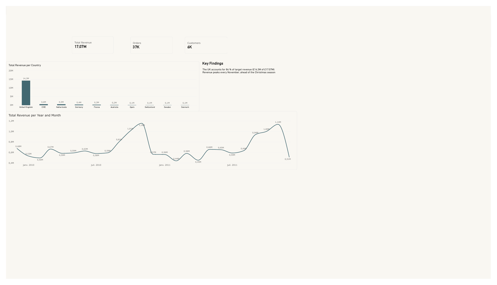

# Retail Data Migration Diagnostic — Snowflake · SQL · Power BI

A simulated retail data migration to Snowflake, built to show how I would profile a legacy data estate, measure its quality, reconcile source and target, and turn the result into decision-ready reporting.

**Author:** Mame Ngom · [LinkedIn](https://www.linkedin.com/in/mamengom) · ngomamediarra@gmail.com



## At a glance

|                         | Rows      | Revenue  |
|-------------------------|----------:|---------:|
| Source (raw)            | 1,067,371 | £19.29M  |
| Target (clean model)    | 776,577   | £17.07M  |
| Excluded (6 documented causes) | 290,794 | £2.22M |
| **Unexplained**         | **0**     | **£0.00** |

Every source row and every pound is either in the target or explained by a documented rule.

## Context

- **Data:** [UCI Online Retail II](https://archive.ics.uci.edu/dataset/502/online+retail+ii) — 1,067,371 sales lines from a UK online retailer, Dec 2009 to Dec 2011.
- **Goal:** treat this file as a legacy "source system", migrate it into a clean Snowflake sales model, and prove the migration is complete and explainable.
- The raw file is loaded **with all its real defects**, on purpose.

## Approach

| Step | What I did | Files |
|---|---|---|
| 1. Raw load | Loaded every column as text so no anomaly is lost at ingestion | `sql/retail_migration.sql` §1 |
| 2. Profiling | Measured 7 data quality rules on the raw table | `sql/retail_migration.sql` §2 |
| 3. Target model | Built a clean sales table with 6 exclusion rules (72.8% of rows kept) | `sql/retail_migration.sql` §3 |
| 4. Gap analysis | Compared source vs target by month; assigned every excluded row one documented cause | `sql/retail_migration.sql` §4 |
| 5. Reconciliation | Checked that rows and revenue balance to zero | `sql/retail_migration.sql` §5 |
| 6. Reporting | 3-page Power BI report: data quality, migration gaps, sales overview | `powerbi/` |

Full rule definitions: [docs/data_quality_rules.md](docs/data_quality_rules.md).

## Key findings

1. **Missing customers are the largest revenue loss.** 22.8% of rows have no customer ID. Excluding them removes £2.57M, or 13.3% of source revenue.
2. **Removing cancellations inflated target revenue.** Cancellation lines were excluded but the original orders were kept, adding £1.46M to the target. Between £281K and £613K of target revenue comes from orders that were later cancelled.
3. **Some defects were invisible at first.** 99% of prices used a comma as decimal separator and could not be read until converted. The source also mixes sales with stock adjustments ("lost", "damaged") and accounting entries ("Adjust bad debt").

## Recommendations (to validate with business teams)

- Keep sales without a customer ID under a **"Guest"** customer instead of excluding them.
- Keep cancellations in a **returns table** and report net revenue; ask the source system for the credit-note → invoice link.
- Move stock adjustments and accounting entries to **separate tables**; keep shipping fees in a "Fees & adjustments" category.
- **Standardise number and date formats at load**, and add automated checks for unreadable values and placeholders such as "Unspecified".

## Dashboard

| Data quality | Migration gaps | Sales overview |
|---|---|---|
|  |  |  |

The `.pbix` file is in [`powerbi/`](powerbi/). Open it with Power BI Desktop (free).

## Repository structure

```
├── README.md
├── docs/
│   └── data_quality_rules.md   # profiling rules, exclusion rules, counts
├── sql/retail_migration.sql    # all Snowflake SQL, one file, 5 sections
├── powerbi/                    # .pbix report
└── images/                     # dashboard screenshots
```

## How to reproduce

1. Download `online_retail_II.xlsx` from the UCI link above and export both sheets to CSV (the raw data is not stored in this repo).
2. In Snowflake, run `sql/retail_migration.sql` from top to bottom (it creates the stage, raw table, target table and gap views).
3. Open `powerbi/*.pbix` and point the Snowflake connection to your account.

## Tools

Snowflake · SQL · Power BI (DAX, Power Query)
